# Nazuki

[](https://github.com/n4o847/nazuki-hs/actions/workflows/ci.yml)

Nazuki ("the brain" in Old Japanese) is a compiler toolchain for generating Brainfuck code. It is implemented in Haskell.

## Playground

Try it out on your browser: https://n4o847.github.io/nazuki-hs/

## Design overview

Nazuki consists of three layers: NazukiScript, NazukiAssembly and NazukiVM.


### NazukiScript

NazukiScript is the most high-level script language that can be written like Python.

```py
a = scan()
b = scan()
print(a + b)
```

### NazukiAssembly

NazukiAssembly is the low-level assembly language that consists of a sequence of instructions and labels.

```
scan
scan
add
print
```

### NazukiVM

The generated instruction sequence is embedded into Brainfuck code along with the virtual machine code that interprets and executes the instructions.

NazukiVM is (currently) a 32-bit stack machine with a text segment and a stack segment.



## Resources

- [Brainfuck にコンパイルされる言語 Nazuki の 2020 年の進捗状況 - 何か書く](https://n4o847.hatenablog.com/entry/2020/12/24/182051)
