# nazuki-hs

[](https://github.com/n4o847/nazuki-hs/actions/workflows/ci.yml)

Nazuki は、Brainfuck をターゲットとするコンパイラおよびツール群です。Haskell で実装されています。

## 各レイヤーの説明



### NazukiScript (仮称)

Nazuki において最も高位のスクリプト言語です。Python のような記述をすることができます。

```python
a = scan()
b = scan()
print(a + b)
```

コードはコンパイラによって後述のアセンブリに変換されます。

### NazukiAssembly (仮称)

Nazuki において使える命令を並べて記述するアセンブリ言語です。スタックベースになっています。

```
scan
scan
add
print
```

### NazukiVM (仮称)

上記のアセンブリをもとに、命令列を埋め込む部分とその命令列を解釈し実行する部分が Brainfuck のコードとして生成されます。

現状は、プログラム領域とスタック領域からなる 32 ビットスタックマシンです。

## ブラウザ版

master ブランチでのコンパイラおよびアセンブラを以下の Web ページで動かすことができます。

https://n4o847.github.io/nazuki-hs/

## 資料

- [Brainfuck にコンパイルされる言語 Nazuki の 2020 年の進捗状況 - 何か書く](https://n4o847.hatenablog.com/entry/2020/12/24/182051)
