# Virtual Machine

## Layouts

### Heap Disabled

### Heap Enabled

## Internal Representation

Since a single cell in Brainfuck can only store values from `0` to `255`, multiple cells are needed to represent a large integer.

It is possible to simply put one byte of information in one cell, but to simplify operations on cells and reduce the total number of times the data is carried, Nazuki only puts `0` or `1` in one cell.

For example, to represent the 32-bit integer `-1` using four cells, it would require 1020 round trips to carry `255`, `255`, `255`, and `255`; using 32 cells, each with a `0` or `1`, it would require 32 round trips.
The trade-off is that the data width is 33/5 times larger, but a properly optimized Brainfuck interpreter can move across 33 cells at once.

### `binary32`

- A data cell takes values `0` or `1`.
- 32 data cells are grouped to represent a value.

> **Note**
> `binary32` is formaly named `arch232`.

### `decimal10`

- A data cell takes values from `0` to `9`.
- 10 data cells are grouped to represent a value.

> **Note**
> `decimal10` is formaly named `arch1010`.

### `word4`

- A data cell takes values from `0` to `255`.
- 4 data cells are grouped to represent a value.

### `word1`

- A data cell takes values from `0` to `255`.
- A single data cell represents a value.

> **Note**
> `word1` is formaly named `arch2561`.
